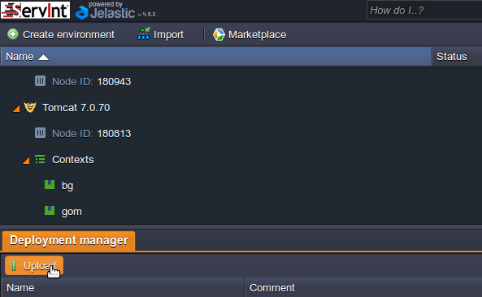
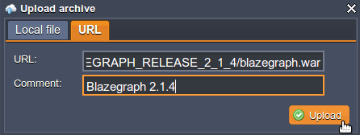
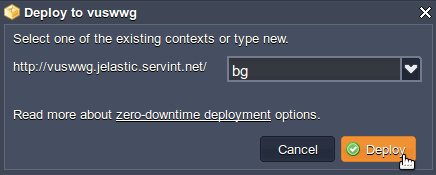
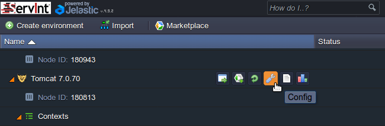
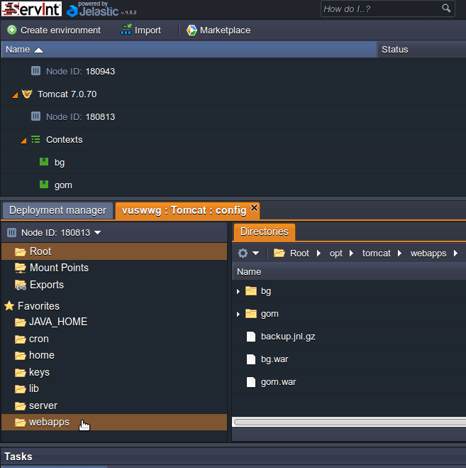
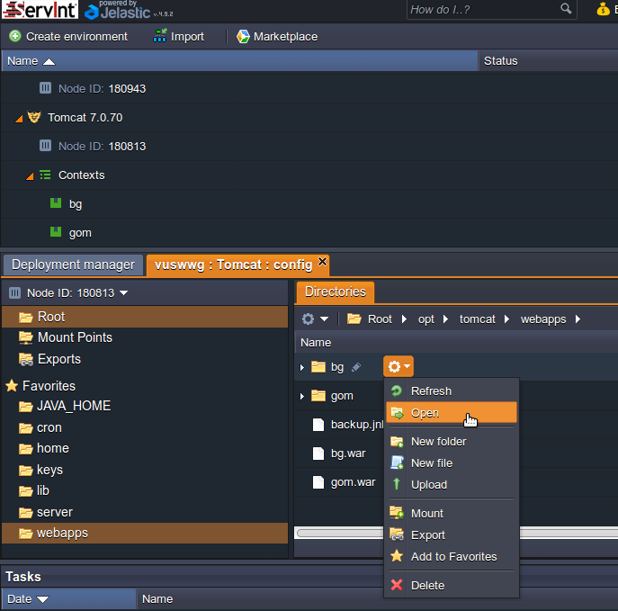
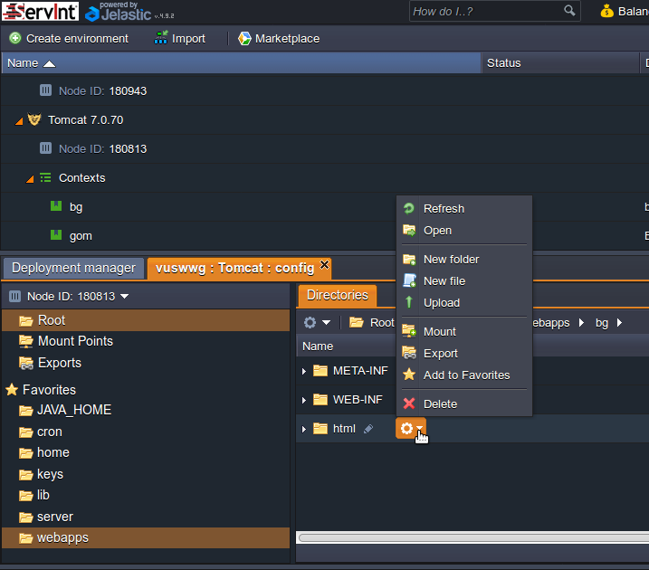
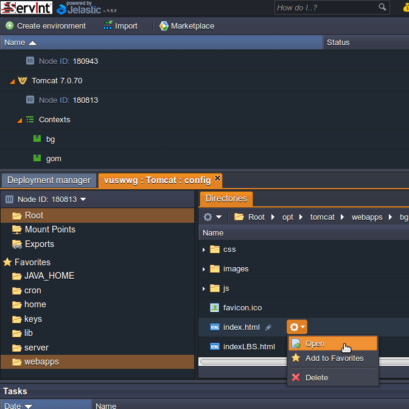
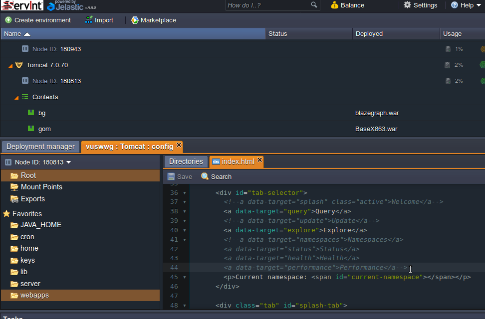

[Return to Table of Contents](README.md)
### Install or upgrade Blazegraph
Note: It is generally safe to upgrade Blazegraph in place. Read the release notes and backup your database before upgrading just to be safe.

On the Deployment Manager tab click the Upload button<br>


On the URL tab paste the location of the Blazegraph.war file to upload. You can find the latest version at [GitHub](https://github.com/blazegraph/database/releases/latest). It is helpful to write the version number in the Comment box.<br>


Deploy Blazegraph<br>


Select the namespace to use<br>


### Default database location
The default database file for Blazegraph is located at `/opt/tomcat/temp/bigdata.jnl`.

You may wish to back up this file or monitor its size when loading large datasets.

### Modify the Blazegraph GUI
First, a short visual guide for modifying Blazegraph files within Jelastic.

Locate the Tomcat instance in the Jelastic UI. Click the wrench to access config settings.<br>


In the new `Tomcat : Config` tab that opened, click on the `webapps` directory.<br>


To the right of the `bg` (substitute your namespace if you didn't use bg) directory click the gear icon then click Open. Alternatively, you can just double-click on the `bg` text to open the directory.<br>


Click on the gear icon to the right of `html` and then click Open. Alternatively, double-click on the `html` directory.<br>


Click on the gear icon to the right of `index.html` and then click Open. Alternatively, double-click on the `index.html` file to open it.<br>


Make changes to the file and save it when finished.<br>


Edit `/opt/tomcat/webapps/bg/html/index.html`, where "bg" is the context name given to Blazegraph in Jelastic. Comment out the following sections like so (look for the \<!-- and --\>):
```
<td width = "20%" border = "0" align = "right" valign = "middle" id = "nopad">
    <!--form id="search-form"><label for="search-text">SEARCH:</label> <input type="text" id="search-text"><button type="submit"><span>&nbsp;</span></button></form-->
</td>
```
```
<div id="tab-selector">
    <!--a data-target="splash" class="active">Welcome</a-->
    <a data-target="query">Query</a>
    <!--a data-target="update">Update</a-->
    <a data-target="explore">Explore</a>
    <!--a data-target="namespaces">Namespaces</a>
    <a data-target="status">Status</a>
    <a data-target="health">Health</a>
    <a data-target="performance">Performance</a-->
    <p>Current namespace: <span id="current-namespace"></span></p>
</div>
```

To further customize the GUI you may edit other files in the `/opt/tomcat/webapps/bg/html/` directory.
