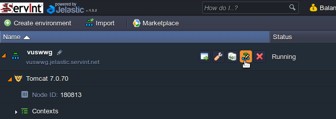
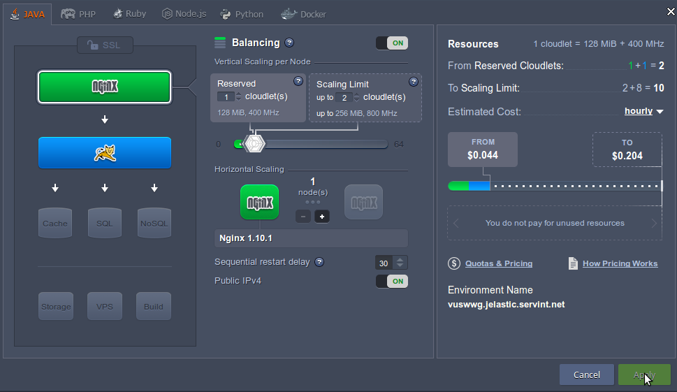
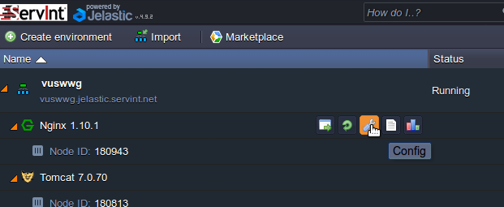
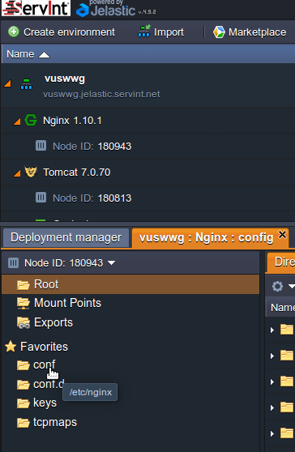
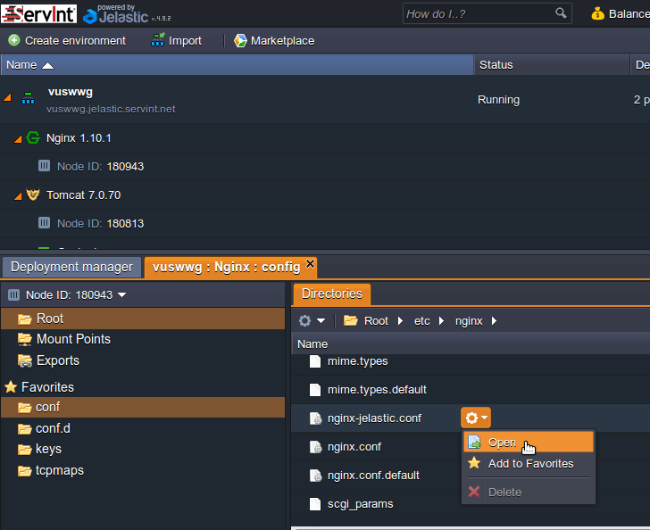
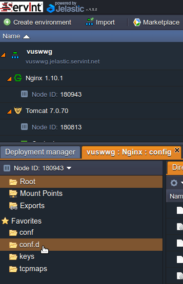
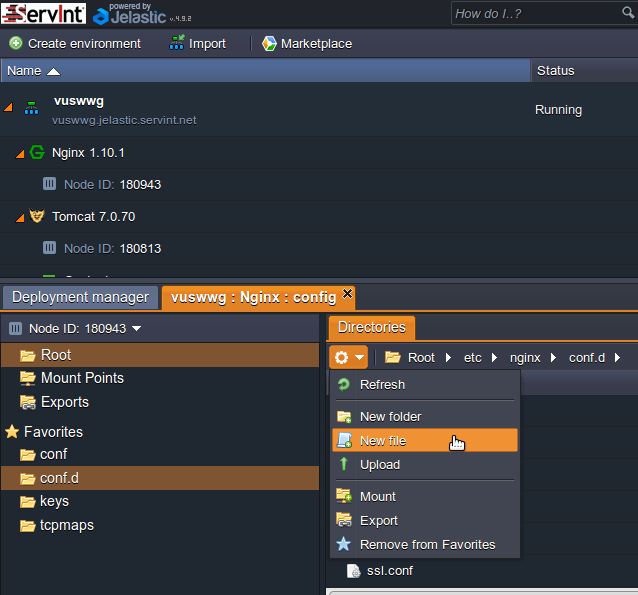
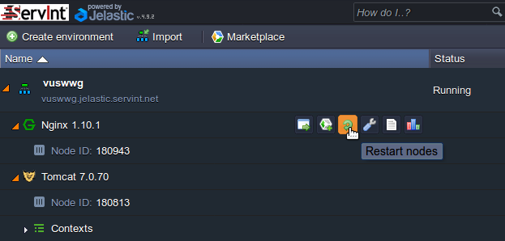
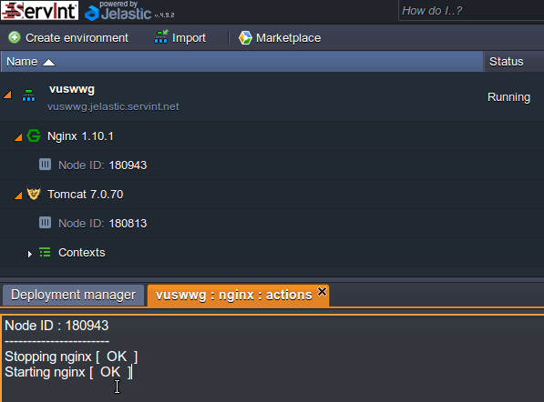

[Return to Table of Contents](README.md)
### Nginx sits in front of other web services and acts as a gatekeeper and reverse proxy

### If Nginx is not already installed, add it to your Jelastic server
Locate and click on the `Change environment topology` icon in the Jelastic UI. It is to the right of your environment's name and doesn't show up until you mouse over the general area.<br>


Add Nginx above your Tomcat server, as shown in the screenshot. Make sure `Public IPv4` is turned on. If your Tomcat server had a public IPv4 you may turn it off for Tomcat now. Set the server scaling limits to your preferences, such as 1 reserved within a scaling limit of 2 as shown in the screenshot. Click Apply.

**Warning: Turning Nginx off and on through the 'Change environment topology' screen will likely cause it to lose its Public IPv4 address.**<br>


### Edit the file `/etc/nginx/nginx.conf`

Locate the Nginx instance in the Jelastic UI. Click the wrench to access config settings.<br>


In the new `Nginx : config` tab that opened, click on the `conf` directory.<br>


Click the gear icon to the right of `nginx.conf` (or whichever file you would like to edit) then click Open. Alternatively, double-click on `nginx.conf`.<br>


#### In /etc/nginx/nginx.conf comment out (add a `#` sign to the start of the line):
`#include /etc/nginx/nginx-jelastic.conf;`

#### Add the line:
`include /etc/nginx/conf.d/*.conf;`

### Create and edit the file `/etc/nginx/conf.d/reverse-proxy.conf`

On the `Nginx : config` tab, click on the `conf.d` directory.<br>


Create a new file named `reverse-proxy.conf` within the /etc/nginx/conf.d/ directory. Click on the gear icon in the upper left corner of the `Directories` tab, then click `New file`<br>


#### Copy the contents of `/etc/nginx/nginx-jelastic.conf` into `reverse-proxy.conf`

#### See [nginx-example.conf](nginx-example.conf) for an example of the complete reverse-proxy.conf.

#### Increase the body and header buffer sizes:
```
client_max_body_size 500m;
large_client_header_buffers 4 32k;
```
#### Set up HTTPS on the Jelastic server:
See [https-setup.md](https-setup.md)

#### Set up basic authentication:
See [authentication-setup.md](authentication-setup.md).

### Restart Nginx

After editing Nginx configuration files it is necessary to restart Nginx for the changes to take effect. Move your mouse to the right of the Nginx appliance text and icons will appear. Click on the curved green arrow labeled 'Restart nodes'.<br>


To confirm that Nginx restarted properly, click on the '\<environment name\> : nginx : actions' tab. If it says 'Starting nginx [ OK ]' it restarted properly. If it failed to restart, double-check any configuration changes you made; there is likely a syntax error.<br>

